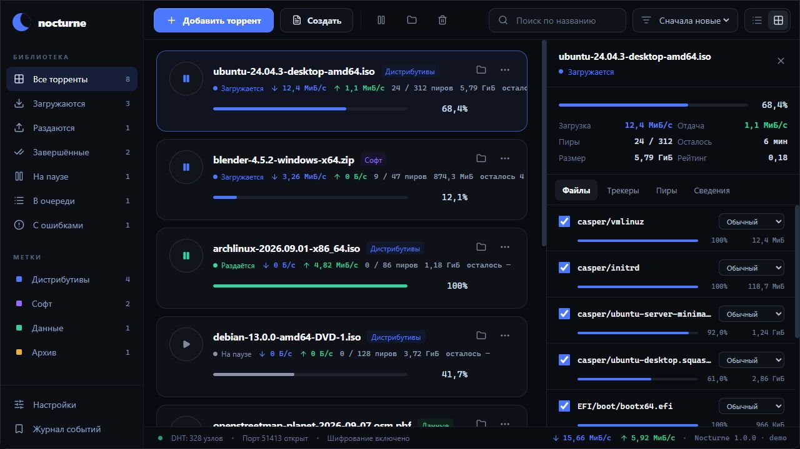

# Nocturne

Nocturne is a cross-platform BitTorrent desktop client built with Wails 3, Go, React, and TypeScript. It was developed as an information security university project and treats torrent metadata, peer traffic, and filesystem paths as untrusted input.



## Features

- `.torrent` files and magnet links, including BitTorrent v1, v2, and hybrid torrents;
- TCP and µTP peer transport, DHT, PEX, HTTP(S)/UDP trackers, IPv6, WebSeed, and MSE/PE through `anacrolix/torrent`;
- download queue, pause/resume, seeding, global speed limits, file selection and priorities;
- live speed, ETA, ratio, peer counts, tracker list, file progress, and event log;
- SQLite session recovery, data recheck, safe task removal, and v1 torrent creation;
- suggested download folder derived from trusted, sanitized torrent metadata;
- system tray with live transfer summary, close-to-tray behavior, single instance handling, and optional launch at sign-in;
- dark Wails/React interface with card and compact list views.

## Download

GitHub Releases are built for Windows, macOS, and Linux. Each release contains a portable build and a native installation format:

| Platform | Portable | Installer |
| --- | --- | --- |
| Windows x64 | ZIP | NSIS `.exe` |
| macOS Apple Silicon / Intel | zipped `.app` | `.dmg` |
| Linux x64 | `.tar.gz` | `.deb` and `.rpm` |

Compare downloads against `SHA256SUMS.txt` from the same release. Unsigned development releases can trigger Windows SmartScreen or macOS Gatekeeper. Maintainers can enable Authenticode signing and Apple notarization with repository secrets described in [RELEASING.md](RELEASING.md).

## Use

1. Select **Добавить торрент** and choose a `.torrent` file or paste a magnet link.
2. Review the proposed destination folder. Nocturne derives its name from torrent metadata, sanitizes it for the operating system, and adds a numeric suffix if the destination already exists.
3. Optionally add the task paused, select files and priorities, then resume it.
4. Configure transfer limits, active download count, completed-task seeding, and launch at sign-in in **Настройки**.

Closing the main window keeps Nocturne running in the system tray. Use the tray menu to reopen it or exit completely.

## Development

Prerequisites:

- Go 1.25;
- Node.js 24;
- Wails CLI `v3.0.0-alpha.96`;
- the native Wails dependencies for the target operating system.

```shell
go install github.com/wailsapp/wails/v3/cmd/wails3@v3.0.0-alpha.96
npm ci --prefix frontend
wails3 dev
```

On Windows, a complete local production build can be created with:

```powershell
./build.ps1
```

Run the project checks with:

```shell
npm run build --prefix frontend
go test ./...
go vet ./...
```

The Go integration tests transfer synthetic data between local clients over the supported torrent and transport variants. They also verify paused transfers, restored priorities, safe removal, unsafe metadata names, and damaged v2 roots.

## Architecture

- `main.go` creates the Wails application and window.
- `torrentservice.go` owns torrents, queue state, limits, telemetry, and SQLite persistence.
- `rootstorage.go` confines torrent file access to an `os.Root` destination.
- `security.go` validates untrusted metadata and paths.
- `desktop.go` implements tray, single-instance, and launch-at-sign-in behavior.
- `frontend/src` contains the React interface and generated Wails bridge usage.

Session data is stored in the operating system user configuration directory under `Nocturne/session.sqlite`. On Windows this is normally `%APPDATA%\Nocturne\session.sqlite`.

## Security scope and limitations

Nocturne rechecks downloaded data after restart instead of trusting persisted completion state. This can take time for large torrents. Pausing stops payload transfer but may allow protocol metadata traffic. MSE encrypts peer traffic but does not provide anonymity. A torrent hash check is not an antivirus scan.

Creating torrents currently produces v1 metadata; loading and downloading supports v1, v2, and hybrid torrents. Public-network interoperability is primarily inherited from the pinned `anacrolix/torrent` engine and should be tested again before a high-risk deployment.

Report vulnerabilities according to [SECURITY.md](SECURITY.md).

## License

Nocturne source code is available under the [MIT License](LICENSE). Dependencies retain their own licenses; see [THIRD_PARTY.md](THIRD_PARTY.md) and the `notices` directory.
